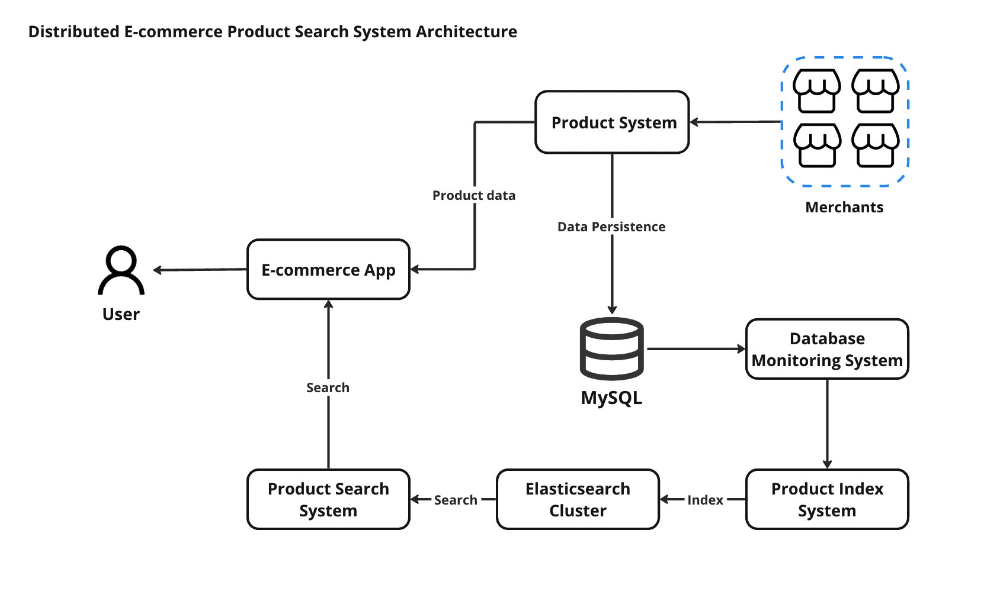
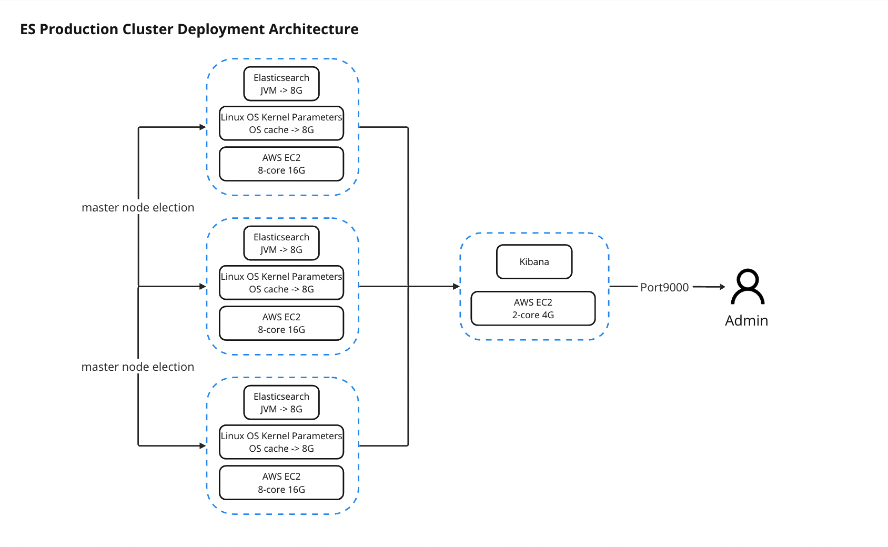

# e-commerce-search-module-design

**MySQL: A Suboptimal Choice for E-Commerce Search**

The information on product is stored within our MySQL database. However, for the purpose of a primary search engine on an e-commerce site, MySQL may not be the most suitable choice.

First and foremost, there could be potential performance bottlenecks. While MySQL performs adequately for simple search queries, complex search operations on larger datasets can potentially degrade performance due to slow response times and resource-intensive operations. Given the fast-paced and responsive search capabilities expected by customers on an e-commerce platform, this could pose significant problems.

Secondly, while it's true that MySQL can be scaled to accommodate larger amounts of data and an increased frequency of queries, this usually necessitates vertical scaling, implying the addition of more resources to a single server. The downside of this approach is that it not only restricts your scalability but also makes your system more susceptible to single points of failure.

Another point to consider is that MySQL isn't tailored for real-time search functionality. This can prove problematic for an e-commerce platform that necessitates instantaneous search capability immediately following data insertion into the database.

**Elasticsearch: A Superior Alternative for E-Commerce Search**

Contrasting with MySQL, Elasticsearch proves to be a more efficient choice for such a system.

Elasticsearch is specifically designed to perform full-text searches, the most prevalent type of search on e-commerce platforms. Full-text search attempts to understand and search text akin to how humans read, thus it can yield far superior results compared to a simplistic pattern match or a 'LIKE' query in SQL.

Elasticsearch indexes data in a manner that's highly optimized for search operations, making it significantly faster than conventional databases for such tasks. It has the capacity to manage large volumes of data and deliver results in near-real time. This feature is critical in ensuring an optimal user experience on an e-commerce platform.

Being inherently distributed, Elasticsearch facilitates easy scaling of your search infrastructure as your data volume and query load burgeon.

